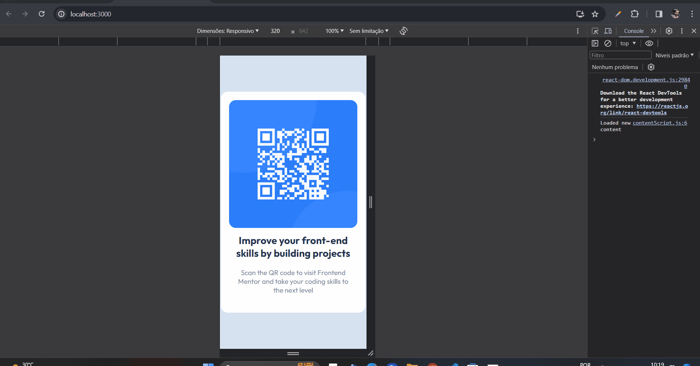

# qr-code-component-react

Este é o meu primeiro projeto `React.js` simples para por em prática minhas primeiras habilidades com a biblioteca.

Nele, além de por em prática conceitos de componentes e funções, coloco em prática conceitos de organização de pastas e arquivos, também.

